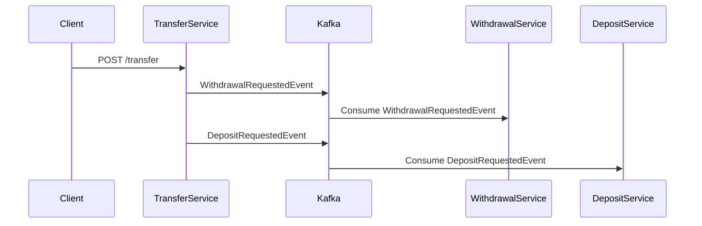

# kafka-transactions-demo
Spring Boot Kafka Transactions Demo

Modules:
- transfer-service (Producer)
- withdrawal-service (Consumer)
- deposit-service (Consumer)

Technologies:
- Java 21
- Spring Boot
- Spring Kafka
- Apache Kafka
- Docker

Full Flow:
User calls transfer API
|
TransferService creates withdrawal event
|
TransferService creates deposit event
|
Kafka transaction starts
|
Send withdrawal event
|
Call remote service
|
If success:
Send deposit event
Commit Kafka transaction
|
Consumers with read_committed can now read both events
|
Withdrawal service consumes withdrawal
Deposit service consumes deposit

Error Flow:
Send withdrawal event
|
Remote service fails
|
Exception thrown
|
Kafka transaction rollback
|
Consumers will not read withdrawal event
Deposit event was not sent

