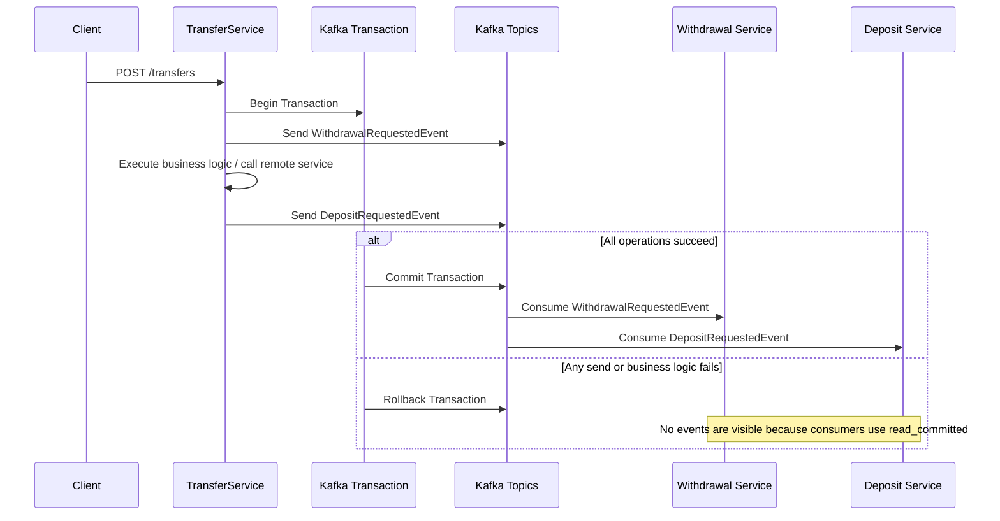

# kafka-transactions-demo

Spring Boot Kafka Transactions Demo

## Modules

* transfer-service (Producer)
* withdrawal-service (Consumer)
* deposit-service (Consumer)

## Technologies

* Java 21
* Spring Boot
* Spring Kafka
* Apache Kafka
* Docker

## Full Flow

User calls transfer API
↓
TransferService creates withdrawal event
↓
Kafka transaction starts
↓
Send withdrawal event
↓
Execute business logic / call remote service
↓
If successful, send deposit event
↓
Commit Kafka transaction
↓
Consumers with `read_committed` can read both events
↓
Withdrawal service consumes withdrawal event
Deposit service consumes deposit event

## Error Flow

Kafka transaction starts
↓
Send withdrawal event
↓
Business logic / remote service fails
↓
Exception is thrown
↓
Kafka transaction is rolled back
↓
Consumers with `read_committed` cannot read uncommitted or aborted events
↓
No partial event is visible to consumer services

## Kafka Transaction Flow

The `TransferService` publishes both `WithdrawalRequestedEvent` and `DepositRequestedEvent` within a single Kafka transaction.

## Key Points

* `WithdrawalRequestedEvent` and `DepositRequestedEvent` are published within the same Kafka transaction.
* The business logic is executed between the two `send()` operations.
* On commit, both events become visible to consumers.
* On rollback, no event is visible to consumers because they use `isolation.level=read_committed`.
* Kafka transactions guarantee atomicity for Kafka writes: either all Kafka messages inside the transaction are committed, or none of them are visible to consumers.
