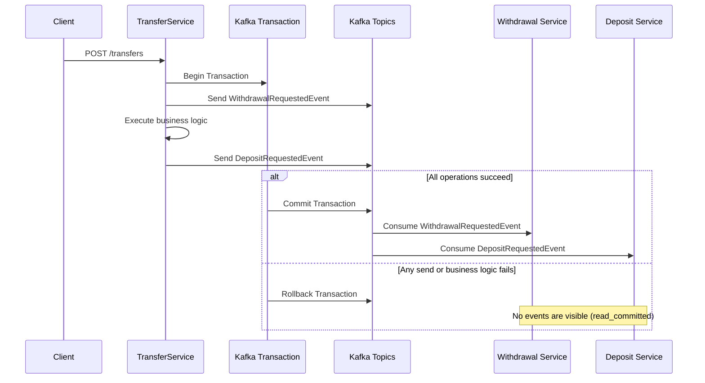

# kafka-transactions-demo
Spring Boot Kafka Transactions Demo

Modules:
- transfer-service (Producer)
- withdrawal-service (Consumer)
- deposit-service (Consumer)

Technologies:
- Java 21
- Spring Boot
- Spring Kafka
- Apache Kafka
- Docker

Full Flow:
User calls transfer API
|
TransferService creates withdrawal event
|
TransferService creates deposit event
|
Kafka transaction starts
|
Send withdrawal event
|
Call remote service
|
If success:
Send deposit event
Commit Kafka transaction
|
Consumers with read_committed can now read both events
|
Withdrawal service consumes withdrawal
Deposit service consumes deposit

Error Flow:
Send withdrawal event
|
Remote service fails
|
Exception thrown
|
Kafka transaction rollback
|
Consumers will not read withdrawal event
Deposit event was not sent

## Kafka Transaction Flow

The `TransferService` publishes both `WithdrawalRequestedEvent` and `DepositRequestedEvent` within a single Kafka transaction.

If the business logic completes successfully, the transaction is committed and both events become visible to consumers. If an exception occurs before the commit, the transaction is rolled back and neither event is consumed.

### Key Points

- `WithdrawalRequestedEvent` and `DepositRequestedEvent` are published within the same Kafka transaction.
- The business logic is executed between the two `send()` operations.
- On **Commit**, both events become visible to consumers.
- On **Rollback**, neither event is visible because consumers use `isolation.level=read_committed`.
- Kafka transactions guarantee atomicity. If any operation inside the transaction fails (sending an event or executing business logic), the transaction is rolled back and no event becomes visible to consumers.
